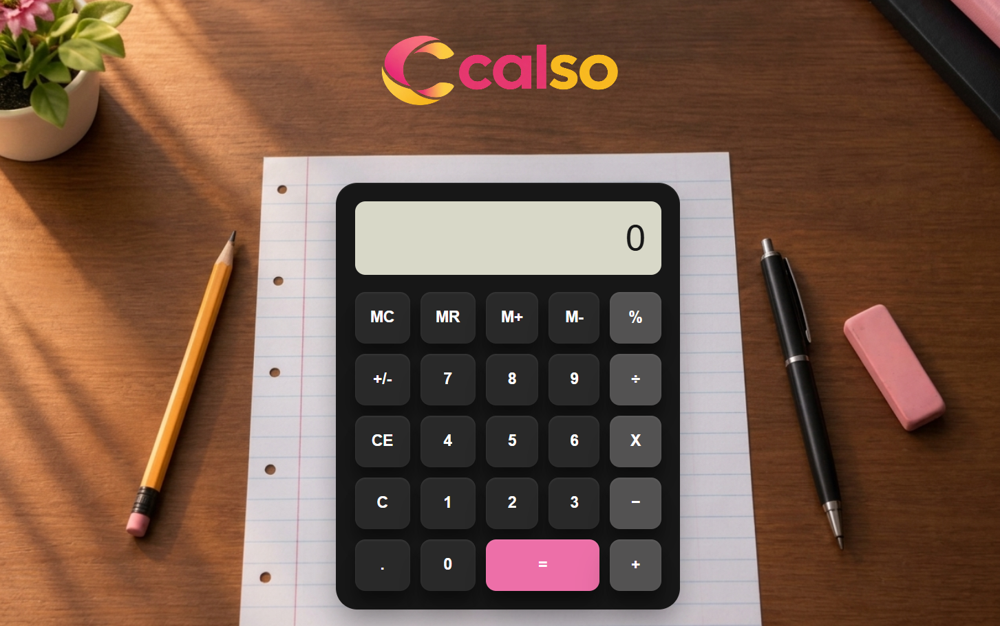

# 📱CALSO | Your Everyday Calculator

---

## 🌐 About This Project

**CALSO** is a core JavaScript project focused on implementing real calculator functionality, including arithmetic operations, memory functions, percentage calculations, repeated equals operations, and large-number handling.

---

## 🚀 Live Demo

🔗 **Website:** https://neorizonnn.github.io/CALSO/

---

## 📸 Preview

|  |

---

## ✨ Features

- Basic arithmetic operations
  - Addition
  - Subtraction
  - Multiplication
  - Division
- Decimal calculations
- Percentage calculation
- Memory functions
  - `MC` — Memory Clear
  - `MR` — Memory Recall
  - `M+` — Memory Add
  - `M-` — Memory Subtract
- 14-digit user input limit
- Scientific notation for large calculation results
- Large scientific-notation results can still be used in further calculations
- Polished and physical calculator inspired UI

---

## 🛠️ Technologies Used

- HTML5
- CSS3
- JavaScript

---

## 📂 Project Structure

Calso-calculator/
│
└── img/
|    ├── bgmain.png
|    ├── logo.png
|    └── favicon.png
│
├── sc
|    ├── sc1.png
|
|── README.md 
├── index.html
├── script.js
├── style.css

---

## 🎯 Purpose

**CALSO** was created as a core **Vanilla JavaScript** learning project to move beyond static websites and practice building interactive functionality projects from scratch.

---

## 🔮 Future Improvements

- Adding responsive media queries for better support across devices of various dimensions.
- Adding scientific calculator functions such as:
  - Square root
  - Powers
  - Trigonometric functions
  - Logarithms etc.
- Adding calculation history
- Adding a dark/light theme option
- Adding more advanced calculator operations and functions

--- 

## 👨‍💻 Developer

**Neorizon**

GitHub: https://github.com/Neorizonnn

Email: neorizon3@gmail.com

---

## 📄 License

This project is intended for learning and inspiration.

Please do not copy or redistribute the project without permission.

For inquiries or collaboration, feel free to contact me.

---

### ⭐ If you found this project interesting, consider giving it a star !!

